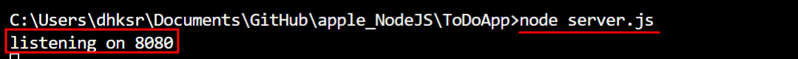
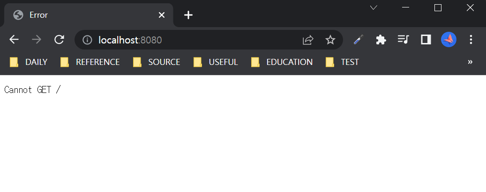
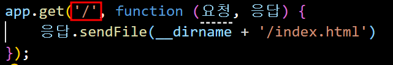
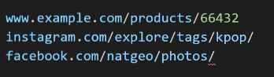

# apple_NodeJS

## level1_1: '서버'가 뭔지 세계 최고로 쉽게 설명해드림
1. 읽기(Get)
2. 쓰기(Post)
3. 수정(Put)
4. 삭제(Delete)

<br>

***

<br>

## level1_2: Node.js의 정체를 알아보자
### Node.js
- 크롬의 JS 해석엔진으로 이뤄짐
- 자바스크립트 실행창, 실행환경
- Node.js 덕분에 JS를 프로그래밍 언어처럼 사용하기 시작

<br>

***

<br>

## level1_3: Node.js의 Non-blocking이라는 장점을 알아보자 (CGV 예매사이트
### Node.js의 특징
- Non-blocking I/O
    - 일단 빨리 처리되는 요청부터 처리하고, 오래걸리는 작업 처리
    - 요청이 많은 SNS, 채팅등에 유리함 (대기시간⬇️)
    
<br>

***

<br>

## level1_4: 두근두근 내 첫서버에서 GET 요청을 처리해보자
### express 라이브러리 기본세팅
- `listen(서버띄울 포트번호, 띄우고 실행할 코드)`
- 포트란? 
    - 컴퓨터엔 외부랑 네트워크 통신을 하기 위한 구멍이 존재함
    - 8080으로 들어오는 사용자는 ~한 작업을 해주세요
    - 포트는 아무 번호 사용 가능

```javascript
const express = require('express');
const app = express();

// 어디에 열지 명시
app.listen(8080, function () {
    // 8080으로 열리면 ~를 출력해주세요
    console.log('listening on 8080')
});
```

<br>

#### 8080포트로 들어가는 방법
- 터미널에 저장을 한 후


<br>

- URL 확인


<br>

### GET 요청 처리하기
- ex: /pet으로 GET요청을 하면 펫상품을 보여줌
- 터미널에 저장 후, 8080/pet로 확인
> 터미널 초기화: ctrl + c

```javascript
// 누군가 /pet으로 방문을 하면~
// 관련된 안내문 띄우기
app.get('/pet', function (요청, 응답) {
    응답.send('펫용품을 쇼핑 할 수 있는 사이트입니다')
})
```
    
<br>

***

<br>

## level1_5: 서버에서 HTML 파일전송해보기 & Nodemon으로 자동화
### 서버 재실행 자동화 시키기
1. `npm install -g nodemon`
    - `-g`: 모든 폴더에서 이용할 수 있게 설치

2. `npm nodemon server.js`

<br>

### 서버에서 HTML 파일전송해보기
1. ~로 접속하면 HTML파일 전송
> '/'은 메인페이지

```javascript
app.get('/', function (요청, 응답) {
    응답.sendFile(__dirname + '/index.html')
});
```
    
<br>

***

<br>

## level1_6: 폼에 입력한 데이터를 서버에 전송하는 법 (POST요청)
### form으로 POST하기
1. form/input 설정
- form
    - `action = "/add"`: 경로
    - `method = Post`: 요청
- input
    - `name="title"`: 서버에서 input을 구분하기 위해

```html
<div class="container mt-3">
    <form action="/add" method="POST">
        <div class="form-group">
            <label>오늘의 할일</label>
            <input type="text" class="form-control" name="title">
        </div>
        <div class="form-group">
            <label>날짜</label>
            <input type="text" class="form-control" name="date">
        </div>
        <button type="submit" class="btn btn-outline-secondary">Submit</button>
    </form>
</div>
```

<br>

2. js에서 POST요청
- /add 경로로 POST요청을 하면 ~해주세요

```javascript
app.post('/add', function (요청, 응답) {
    응답.send('전송완료')
});
```

<br>

3. **body-parser** 설치
- input에 적은 정보는 '요청'에 저장되어 있음 
- 꺼내오려면 body-parser 설치
- body-parser는 요청 데이터 해석을 도와줌

```javascript
app.post('/add', function (요청, 응답) {
    응답.send('전송완료')


    // body-parser 설치 후
    // 요청.body하면 form에 입력된 정보를 서버에 전달
    console.log(요청.body.title)
    console.log(요청.body.date)
});
```

<br>
    

***

<br>

## level1_7: (쉬어가기) REST API가 뭔지 세계 최고로 쉽게 설명해드림
> API를 REST하게 만들면 좋다!

<br>

### API란
- 웹서버와 고객간의 소통방법
- 어떻게 해야 서버랑 통신할 수 있을까?



- 서버랑 통신하는 방법(= API)? 👉 `/경로`
- 이런 API를 어떤식으로 만들어야 좋은 API일까?

<br>

### REST API란
> REST하게 API를 만들자!

#### REST 원칙
- URL은 간결하고, 일관성 있고, 예측이 가능해야함

<br>

#### 좋은 REST API
> 이름짓기 원칙

- 명사로 작성
- 하위문서를 나타낼 땐/
- 확장자(.html)쓰지 않기
- 띄어쓰기는 대시(-) 이용
- 자료 하나당 하나의 URL



<br>
    

***

<br>

## level2_1: MongoDB 셋팅하기 (무료 호스팅도 받아보자)

### 데이터를 저장하는 DB종류
1. 관계형
    - 행과 열, 엑셀형식, 2차원 데이터들
    - SQL 언어 사용
    - MySQL, MariaDB, Oracle, MS SQL Server

2. NoSQ
    - JS OBJ랑 유사
    - Dynamo, Oracle NoSQL, MonggoDB, Redis, Cassandra
